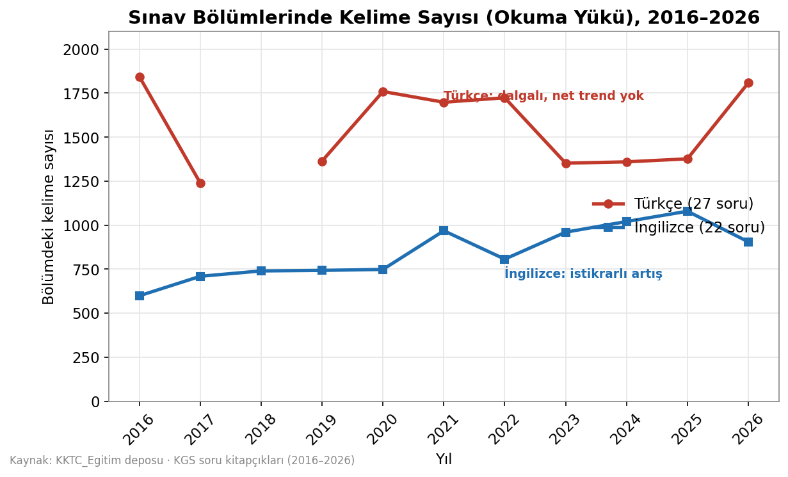
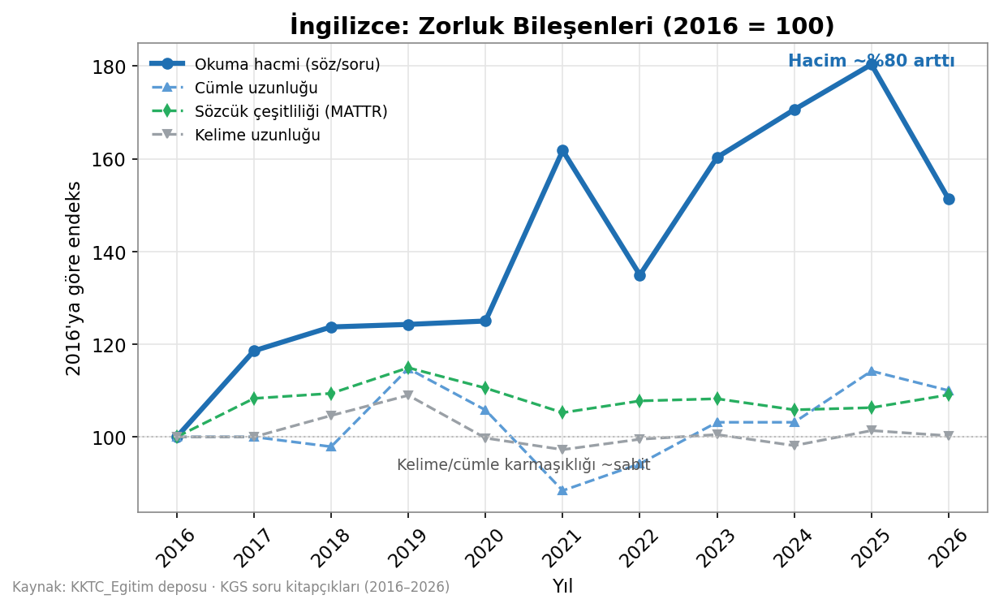
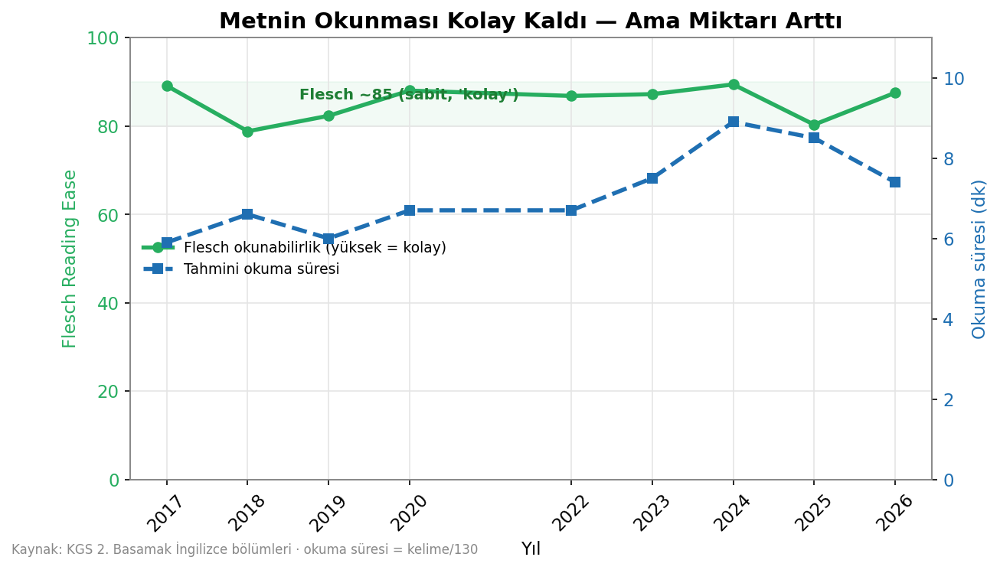
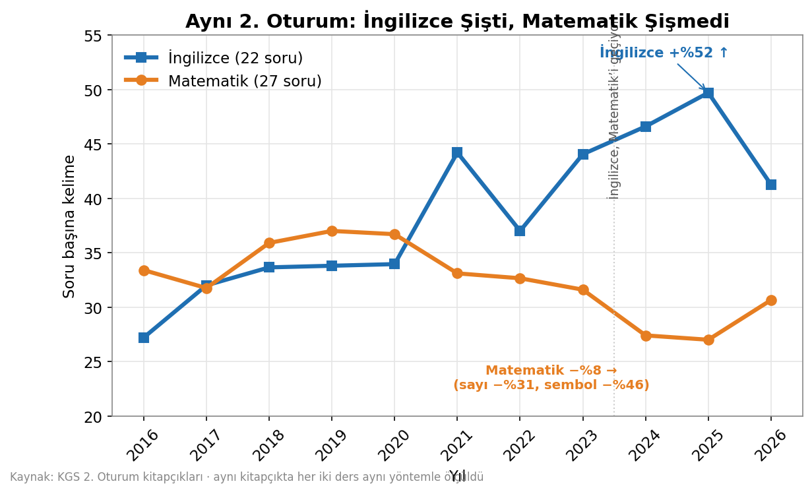
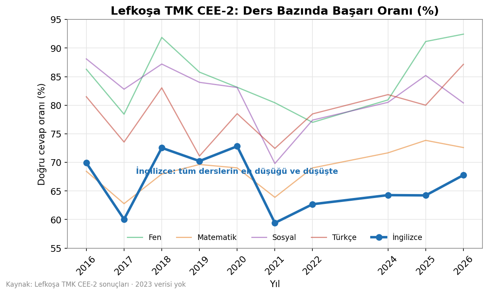
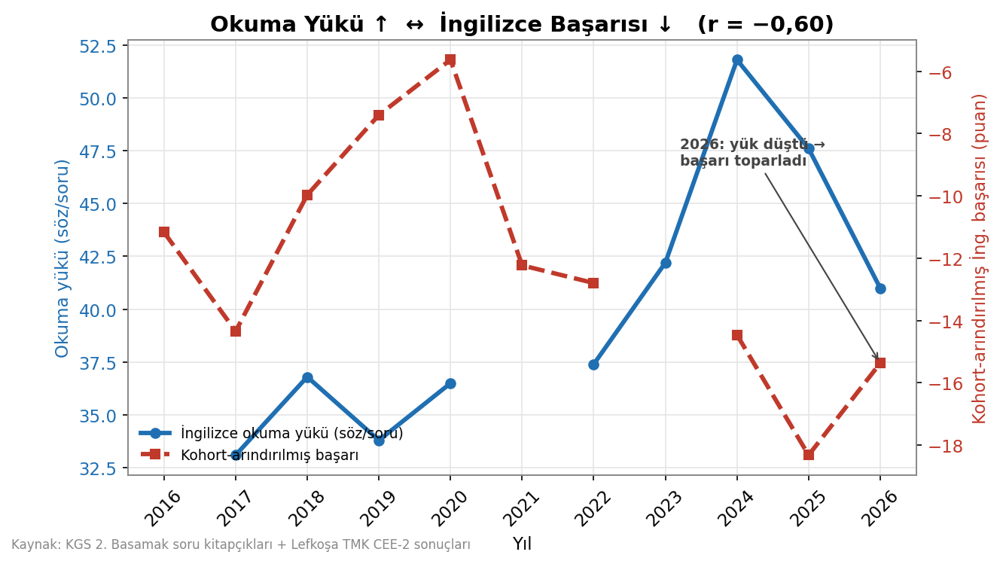

# 📊 Sınav Verisi — KKTC Kolejlere Geçiş Sınavı (KGS) Analizi, 2016–2026

> **Özet (TL;DR):** Son on yılda KGS **İngilizce** sınavının zorluğu arttı — ama daha zor kelimeler ya da daha karmaşık cümlelerle değil, **sabit sürede okutulan metin miktarının neredeyse iki katına çıkmasıyla.** Yani sınav giderek daha çok bir *"okuma hızı ve dayanıklılığı"* sınavına dönüştü. **Türkçe** bölümünde ise benzer bir yön yok; okuma yükü yıldan yıla dalgalanıyor.

Bu bölüm, depodaki orijinal KGS soru kitapçıklarından üretilen **niceliksel bir analizdir**. Amaç, öğrenci ve eğitimcilere sınavın yıllar içinde nasıl değiştiğini şeffaf, ölçülebilir ve anlaşılır biçimde göstermektir.

---

## 1. Bu analiz nedir?

Depodaki **2016–2026 yılları arasındaki KGS soru kitapçıkları** taranarak her sınavın İngilizce ve Türkçe bölümlerinin metni çıkarıldı ve şu sorular yanıtlandı:

- Sınavda kullanılan **kelime sayısı** yıllar içinde nasıl değişti?
- İngilizce zorlaştıysa bunun nedeni **hacim** mi (daha çok okuma), yoksa **karmaşıklık** mı (daha zor kelime/cümle)?
- Bu değişim, gerçek **sınav sonuçlarıyla** örtüşüyor mu?

Analiz birimi, sonuç verisiyle eşleştiği için **2. Basamak (Haziran / CEE‑2)** sınavlarıdır.

---

## 2. Sınav yapısı

| Oturum | Dersler | Soru sayısı |
|---|---|---|
| **1. Oturum** | Türkçe · Fen · Sosyal | 27 · 14 · 10 |
| **2. Oturum** | İngilizce · Matematik | **22 · 27** |

> 🔑 **Kritik nokta:** İngilizce ve Matematik **aynı 90 dakikalık oturumu paylaşır.** Yani İngilizce bölümü uzadıkça, öğrencinin aynı süre içinde işlemesi gereken toplam metin de artar.

---

## 3. Ana bulgu: okuma yükü

İngilizce bölümünün kelime sayısı 2016'da ~600 iken 2024–2025'te ~1.080'e çıktı — **yaklaşık iki kat.** Türkçe ise ~1.250–1.975 bandında dalgalanıyor; belirgin bir yön yok.

| Yıl | İngilizce (kelime) | Türkçe (kelime) |
|----:|----:|----:|
| 2016 | 599 | 1.843 |
| 2018 | 740 | *(veri yok)* |
| 2020 | 748 | 1.759 |
| 2022 | 807 | 1.724 |
| 2024 | 1.020 | 1.360 |
| 2025 | **1.079** | 1.376 |
| 2026 | 906 | 1.808 |

*(Yıllık ortalamadır; bir yılda iki basamak varsa ortalaması alınmıştır. İngilizceye özgü derinlemesine analizler aşağıda **2. Basamak / CEE‑2** verisine dayanır.)*

---

## 4. İngilizce neden zorlaştı?

Zorluğu dört bileşene ayırıp her birini 2016 = 100 endeksine çevirdiğimizde resim nettir:

- 🔵 **Okuma hacmi (söz/soru):** ~%80 arttı.
- ⬜ **Cümle uzunluğu, sözcük çeşitliliği (MATTR), kelime uzunluğu:** ~sabit kaldı (95–115 bandı).

Yani metin **daha zor hale gelmedi**, sadece **daha uzun** hale geldi. Bunu okunabilirlik endeksleri de doğruluyor:

**Flesch okunabilirlik puanı on yıl boyunca ~85'te sabit kaldı** (yani metin baştan sona "kolay", yaklaşık 5. sınıf okuma seviyesi). Değişen tek şey, o kolay metinden **ne kadarının** okunması gerektiği: tahmini okuma süresi ~5,9 dakikadan ~8,9 dakikaya çıktı.

> 💡 **Kelime çeşitliliği de mi arttı?** Evet — farklı kelime sayısı %30, ileri/nadir kelime sayısı ~3 kat arttı. Ama bu, metnin **uzaması** nedeniyle oldu; ileri kelimelerin *oranı* ve ortalama kelime nadirliği sabit kaldı. Yani öğrenci daha geniş bir dağarcıkla karşılaşıyor, ama bu *aynı zorluk karışımının daha fazlası*, daha zor bir karışım değil.

---

## 5. Aynı oturum kontrolü: Matematik şişmedi

İngilizce ve Matematik **aynı 90 dakikalık 2. Oturumu** paylaştığı için bu, güçlü bir kontrol sağlar: eğer okuma yükündeki artış sınavın genel bir eğilimi olsaydı, Matematik de şişerdi. Her iki dersi aynı kitapçıkta, birebir aynı yöntemle ölçtük.

Sonuç tezi doğruluyor — hatta aşıyor:

| Yük ölçütü (2. Oturum) | 2016 → 2026 | Yıl trendi |
|---|:---:|:---:|
| İngilizce kelime | **+%52** | ▲ (r = +0,87) |
| İngilizce karakter | **+%48** | ▲ (r = +0,86) |
| Matematik kelime | −%8 | ▼ (r = −0,66) |
| Matematik karakter | −%10 | ▼ (r = −0,71) |
| Matematik sayı (rakam) | −%31 | ▼ (r = −0,81) |
| Matematik sembol (operatör) | −%46 | ▼ (r = −0,76) |

Matematik yalnızca sabit kalmadı; ölçülebilir metin/sembol yükü **hafifledi.** Dahası çarpıcı bir **çaprazlama** var: 2016'da Matematiğin metin yükü İngilizcenin ~2 katıyken, 2024–2025'te **İngilizce Matematik'i geçti.** Yani 2. Oturumdaki okuma yükü artışı tamamen **İngilizceye özgüdür** — bu da İngilizce başarısındaki düşüşün, oturumun genel zorlaşmasından değil, İngilizcenin *kendi* okuma yükünden kaynaklandığı yorumunu destekler.

> ⚠️ **Yorumlama notu:** Geometri/şekil içeren Matematik soruları görsel olduğundan metne yansımaz; bu sayılar Matematiğin *kavramsal* zorluğunu değil, *metin + sembol* yükünü ölçer. Şekil yükü yıllar arası sabit varsayıldığında trend karşılaştırması geçerlidir. Ayrıca Matematik başarısı bu dönemde *yükseldi* — bu da ölçülebilir Matematik yükünün artmadığı bulgusuyla tutarlıdır.

---

## 6. Sonuçlara yansıması

Peki bu, gerçek başarıya yansıyor mu? Lefkoşa TMK CEE‑2 sonuçlarına bakalım:

İngilizce, **tüm derslerin en düşük başarı oranına** sahip (%66) ve düşüşte. Kritik olan şu: aynı okul, aynı seçici öğrenci profili **Matematik, Fen ve Türkçe'de yükselirken** İngilizce'de geriliyor. Bu, sorunun genel bir öğrenci zayıflaması değil, **İngilizceye özgü** olduğunu gösterir.

| Ders | Ortalama başarı | Yıllık trend |
|---|---:|:---:|
| Fen | %84,7 | ▲ |
| Sosyal | %81,9 | ▼ |
| Türkçe | %78,8 | ▲ |
| Matematik | %68,9 | ▲ |
| **İngilizce** | **%66,4** | **▼** |

Öğrenci kohortunun gücünü matematiksel olarak arındırdığımızda (her yıl diğer derslerin ortalamasını çıkararak), İngilizce okuma yükü ile başarı arasında **ters bir ilişki** ortaya çıkıyor:

| İlişki (kohort‑arındırılmış başarı ile) | Korelasyon |
|---|:---:|
| **Okuma süresi / hacim** | **r = −0,60** |
| Farklı kelime sayısı (hacimle birlikte) | r = −0,57 |
| İleri kelime *oranı* (normalize) | r ≈ 0 *(etkisiz)* |
| Flesch okunabilirlik (yapısal) | r ≈ 0 *(etkisiz)* |

Yalnızca **hacim** içeren ölçütler başarıyı açıklıyor. Yapısal zorluk ölçütleri açıklamıyor.

---

## 7. 2026: doğal bir test

Hipotez "okuma yükü başarıyı sürüklüyor" diyorsa, yükün düştüğü bir yılda başarı toparlamalı. 2026 tam da bu testi sağladı:

| Yıl | Okuma yükü (söz/soru) | Okuma süresi | İngilizce başarı |
|----:|----:|----:|----:|
| 2024 | 51,8 | 8,9 dk | %64,3 |
| 2025 | 47,6 | 8,5 dk | %64,2 |
| **2026** | **41,0 ▼** | **7,4 dk ▼** | **%67,8 ▲** |

Yük 2024 zirvesinden geriledi → İngilizce başarısı 2020'den beri en yüksek seviyeye çıktı. Bu **doz‑yanıt** örüntüsü, "zorluğu sürükleyen şey okuma hacmidir" yorumunu güçlendiriyor.

---

## 8. Öğrenciler için çıkarımlar

Veri, İngilizce sınavının bir **hız + dayanıklılık** sınavına kaydığını gösteriyor. Buna göre:

- 📖 **Okuma hızını ve dayanıklılığını geliştir.** Kelime ezberi tek başına yetmez; uzun metinleri *akıcı* okuyabilmek belirleyici hale geldi.
- ⏱️ **Süreli alıştırma yap.** Gerçek sınav koşullarında, uzun parçalarla zaman tutarak çalış.
- 🔎 **Tarama (skimming/scanning) tekniklerini öğren.** Sorunun cevabını metnin tamamını yeniden okumadan bulabilmek zaman kazandırır.
- 🧭 **2. Oturum zaman yönetimi.** İngilizce uzadığı için, İngilizce ve Matematik arasında süre dağılımını önceden planla.

## 9. Eğitimciler için çıkarımlar

- 🏃 **Akıcılık odaklı çalışma.** Yalnızca dil bilgisi/kelime değil, *süreli okuduğunu anlama* pratiğine ağırlık vermek bu veriyle tutarlıdır.
- 📚 **Uzun parçalarla hazırlık.** Son yılların sınavları daha uzun okuma parçaları içeriyor; hazırlık materyalleri bunu yansıtmalı.
- 📈 **Hedefli ölçme.** Öğrencilerin zorlandığı yer kelime zorluğu değil, *hacim altında hız* olabilir; ölçme bunu ayırt edecek şekilde tasarlanabilir.

---

## 10. Yöntem

1. **Metin çıkarımı:** Soru kitapçıkları `PyMuPDF` ile işlendi. Her bölüm, başlık (`İNGİLİZCE TESTİ` / `TÜRKÇE TESTİ`) ile bitiş ifadesi (`BİTMİŞTİR`) arasından izole edildi; Matematik/Fen/Sosyal hariç tutuldu.
2. **Temizlik:** Tekrarlayan sayfa başlıkları, sayfa numaraları ve şık etiketleri (`A)`, `1)`) ayıklandı. Eski sınavlardaki karakter kodlaması (mojibake) ve kelime parçacıkları düzeltildi (sözlük filtresi).
3. **Metrikler:**
   - *Söz/soru* = bölümdeki kelime ÷ soru sayısı (İngilizce 22, Türkçe 27).
   - *MATTR* (sözcük çeşitliliği), *ortalama kelime sıklığı* (Zipf), *nadir kelime oranı* (wordfreq).
   - *Flesch Reading Ease*, *Flesch‑Kincaid*, *Gunning Fog* (textstat).
   - *Matematik yükü:* aynı 2. Oturum kitapçığında kelime, rakam, operatör sembolü ve karakter sayısı (İngilizce ile birebir aynı yöntem).
   - *Okuma süresi* = kelime ÷ 130 (L2 dikkatli okuma hızı varsayımı).
4. **Kohort arındırma:** Her yıl İngilizce başarısından, diğer dört dersin ortalama başarısı çıkarıldı; böylece o yılki öğrenci kohortunun genel gücü nötrlendi.
5. **Korelasyon:** Pearson *r*, kohort‑arındırılmış İngilizce başarısı ile her metrik arasında (eşleşen 8 yıl).

> **Yeniden üretilebilirlik:** Bu analizin tüm Python kodu ve çalıştırma talimatları [`analiz_kodu/`](analiz_kodu/) klasöründedir; tek komutla ([`python calistir.py`]) tüm tablolar, grafikler ve Excel dosyası sıfırdan üretilir. Konsolide çalışma kitabı: [`KGS_Ingilizce_Analiz.xlsx`](KGS_Ingilizce_Analiz.xlsx).

---

## 11. Sınırlar ve dürüstlük payı

- 📌 Bulgular **korelasyon**dur, nedensellik kanıtı değildir. Örneklem küçüktür (n = 8 yıl).
- 🏫 Sonuç verisi **tek bir okula** (seçici Lefkoşa TMK) aittir; bu, kohort kontrolünü güçlendirir ama genellenebilirliği sınırlar.
- 🗓️ 2023 sonuç verisi mevcut değildir; 2016 ve 2021'in 2. Basamak kelime verisi eksiktir; 2018 Türkçe bölümü depoda yoktur.
- 📐 Okuma süresinin **mutlak** değeri varsayılan okuma hızına bağlıdır; ancak yıllar arası **~%50'lik artış** doğrudan kelime sayısından gelir ve bu varsayımdan bağımsızdır.
- 🔡 Başarı, sınav zorluğunun yanı sıra öğretim, müfredat ve okul dışı dil maruziyetinden de etkilenir.

---

*Bu analiz, KKTC ilk ve orta eğitim için açık kaynak bir katkıdır. Paylaşılabilir ve atıf yapılarak kullanılabilir.*
